# Architecture

ScoutFlow AI is designed as a small agentic workflow that can be explained clearly in a 3-5 minute hackathon demo.

```mermaid
flowchart LR
    A["Recruiter enters JD"] --> B["JD Parser: fallback or OpenAI"]
    B --> C["Structured role requirements"]
    C --> D["Candidate Discovery"]
    D --> E["Match Scoring"]
    E --> F["Explainability Layer"]
    F --> G["Outreach Simulator: fallback or OpenAI"]
    G --> H["Interest Scoring"]
    H --> I["Ranked Shortlist"]
    I --> J["CSV and JSON Export"]
```



## Components

### 1. JD Parser

Extracts:

- Role title
- Required skills
- Domain signals
- Minimum experience
- Location
- Work mode

Current prototype uses keyword and regex parsing as a reliable fallback. When an OpenAI key is available, the app uses AI extraction for richer structured fields.

### 2. Candidate Discovery

Current prototype loads candidates from:

```text
data/candidates.json
```

Production options:

- GitHub REST API for public technical profiles
- ATS database
- Recruiter CRM
- People Data Labs
- SerpApi or search APIs for public profile discovery

### 3. Match Scoring

The match engine combines:

- Skill overlap
- Lightweight cosine text similarity
- Experience fit
- Domain overlap
- Location/work-mode compatibility
- Availability

Each candidate receives a `match_score` from 0 to 100.

### 4. Outreach Simulation

The agent generates a recruiter-style first message and simulates a candidate reply based on profile metadata such as:

- Availability
- Candidate openness
- Work preference
- Response style

Each candidate receives an `interest_score` from 0 to 100. With OpenAI enabled, the top candidates receive personalized outreach, simulated replies, risk flags, and next actions.

### 5. Ranked Shortlist

Candidates are sorted by:

```text
Final Score = 0.65 * Match Score + 0.35 * Interest Score
```

The output gives recruiters:

- Ranked candidates
- Explainability
- Outreach transcript
- JSON action output
- CSV export

## Why This Design Works For A Hackathon

- It demonstrates the complete recruiter workflow.
- It avoids fragile LinkedIn scraping.
- It is explainable enough for judges.
- It can run locally without paid APIs.
- It can use OpenAI for a stronger judged demo.
- It leaves a clear path to production integrations.
